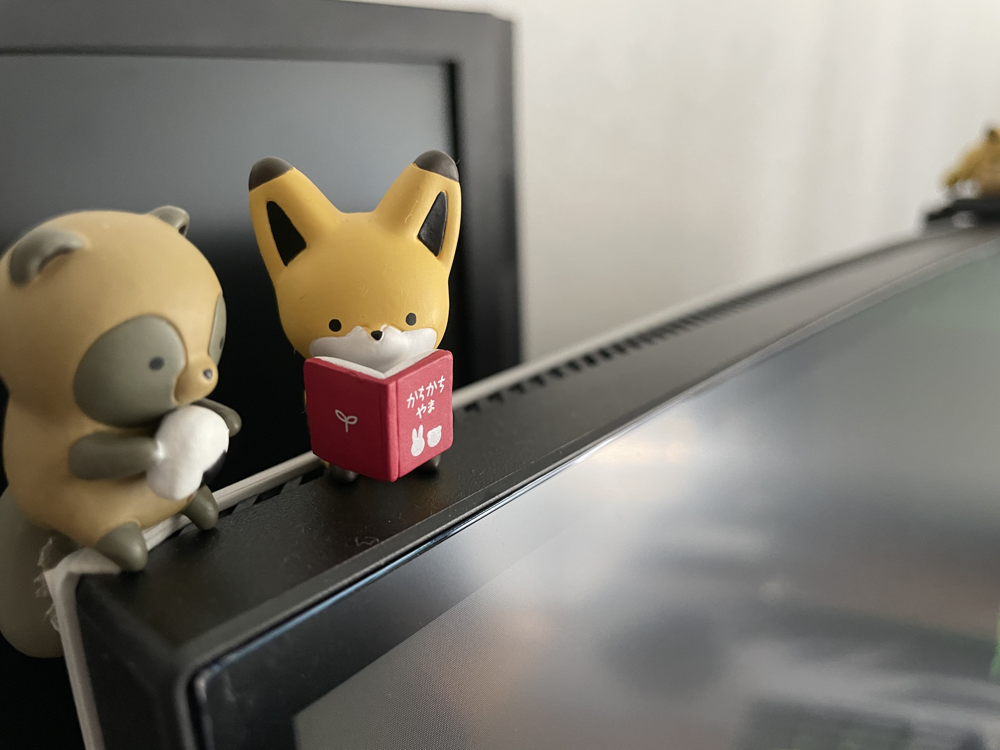

ウルトラワイドモニターを買ったってお話。
元々、ALIENWAREの"AW3418DW-R"の見た目が好きで、欲しかったが当時の資金力では買うことが出来なかった。
しかし、社会人2年目にして、AW3821DWを買うに至る。
モデルチェンジ？によって画面が大きくなったことと価格差があまりなかったため、こちらを購入。

その他検討したモデル:
他に購入を考えていたモニターとしてはMSIの2つがある。

- Prestige PS341WU
- Optix MAG342CQRV

Optixは、もともと使っていたモニターとキャラクターが似ていること、Prestigeは想定するゲーム用ととは少し離れていることがある。

価格:
133,860円(25%OFFクーポン適用)

使用感:
{1月くらい経ったら書く}

まとめ:
安いモニターを探せば他にいくらでもあるが、38インチウルトラワイド144Hzのモニターは他に無い。
ドット抜けも無く、外装の品質も高いことから満足度はこの上無い。
願わくば13年くらい活躍してくれることを期待して。

