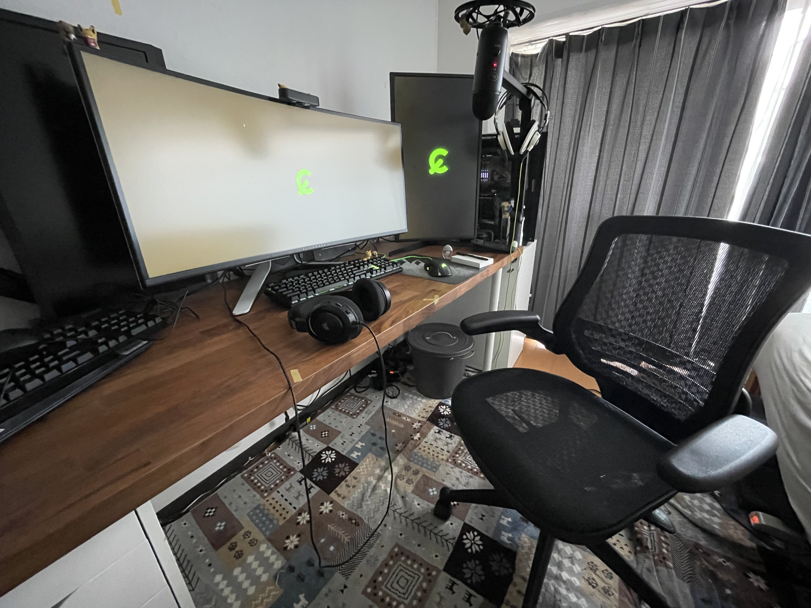

椅子遍歴:
ニトリの学習椅子 -> リビングにあったダイニングチェア -> イームズチェア -> オフィスチェア(いまここ！)

ニトリの椅子を小学1年生から高3くらいまでずっと使っていた。
その後支柱部分？が破損し、15度くらい座面が傾くようになったため、リビングのダイニングチェアを失敬し、ずっと使っていた。この経験から得た知見は2つ。

- 椅子長持ち。
- ダイニングチェア悪くない。

ニトリの椅子が10年近く持った実績から分かるように数千円の椅子でも10年近く使えることが分かる。ましてや、機械的な構造を持たないダイニングチェアなどにおいては、木の部分の劣化は見られるが椅子としての機能を失うことはないだろう。
そこで、一人暮らしをするにあったっては、シンプルなデザインで、実家で使っていたダイニングチェアと同じくらいの高さの椅子を購入すると決めていた。
そこで白羽の矢が立ったのが、イームズチェア(ジェネリック品)。
楽天で4千円台で購入出来て見た目が好きだったので文句のないモノだった。
しかし、長く使っているとどうもお尻が痛くなる。汗っかきなのもちょっと相性が悪かった。
そこで、ずっと買おうと思っていた"エルゴヒューマン"か"アーロンチェア"を買おうと下調べを開始した。
エルゴヒューマンは、toアーロンチェアを5年以内にしているユーザを見かけたり、買い替えを行っている例がいくつか見られた。
また、アーロンチェアにおいても人によってはあまり合わないとコメントする例が見られた。
そこで、ワーカーホリックとかに見に行こうかとも思ったが、得意の出不精が発動し、うだうだしている間に今回の椅子を見つけた。
購入に至った理由は以下の3つ。

- 価格が安く、フルメッシュの椅子の使用感を試せること
- 金属の外装を使っていないため、サビを考慮しなくて良いこと
- ひじ掛けが無い状態(背面と同じ位置まで上げれる)に出来ること

使用感:
{1月くらい経ったら書く}

まとめ:
比較的小さめ、フルメッシュ、多少のリクライニング有と求めていたものが揃っていたため満足している。
3年くらいで次の椅子として10万くらいの椅子を買うための判断材料して買ったが、あまりの満足感に壊れるまで買い替えはないかもしれない。
思えば、小学生の頃の私も当時好きだった青色の椅子にワクワクし、高校生になっても使い続けていたのだから。
